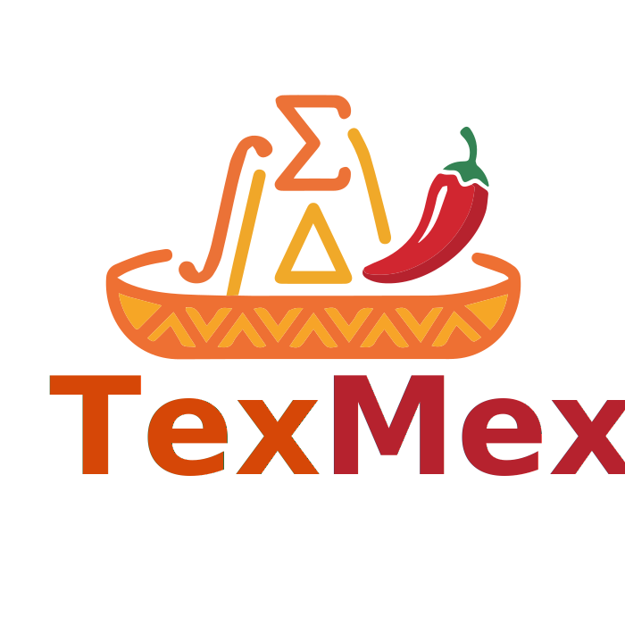

<p align="center">
  
</p>

# TexMex — Collaborative LaTeX Editor

[](LICENSE)

A web-based collaborative LaTeX editor with real-time multi-user editing (Yjs/CRDT) and isolated server-side compilation to PDF.

- **Client** — React + TypeScript (Vite), Monaco editor, Yjs over WebSocket.
- **Server** — ASP.NET Core 10, Postgres, Yjs WebSocket relay at `/ws/{documentId}`, REST API at `/api/...`.
- **LaTeX compiler** — separate container, isolated from the public network, called only by the server.

## Quick links
- Dev client: http://localhost:5173
- Dev server / Swagger: http://localhost:3000/swagger
- Production: http://localhost:${HTTP_PORT:-80} (after the prod compose is up)

## Requirements
- Node.js 20+ and npm (Vite 5 and the openapi-ts generator both require 20).
- .NET SDK 10 (server target framework).
- Docker + Docker Compose v2 (full-stack dev and the LaTeX compiler container).

## Quickstart — Development

```bash
git clone git@github.com:texmex-editor/texmex.git
cd texmex
cp .env.example .env

# Whole stack in Docker (client + server + db + latex-compiler)
make up

# OR: infra in Docker, server + client locally (debugger-friendly)
make infra
cd server && dotnet run                   # in one terminal
cd client && npm ci && npm run dev        # in another
```

`make help` lists the available targets (`up`, `down`, `build`, `logs`, `infra`, `infra-down`, `backend-local`, `clean`).

## Quickstart — Production

One compose file brings up the whole stack with nginx serving the bundled
client and proxying `/api/*` + `/ws` to the server. No Node, no
devDependencies, no Playwright in the runtime image (~95 MB vs ~1.5 GB
for the dev image).

```bash
cp .env.production.example .env.production   # set ALLOWED_ORIGINS, passwords
docker compose -f docker-compose.prod.yml --env-file .env.production up -d --build
```

See [`DEPLOYMENT.md`](DEPLOYMENT.md) for the full deployment walkthrough (TLS, CORS, cookies, reverse-proxy notes).

## Project Structure

- `client/` — React + TypeScript frontend (Vite).
  - `src/pages/` — routes (editor, landing, document join, …).
  - `src/components/` — UI components and the files-panel + editor sidebar.
  - `src/utils/` — editor integration (Monaco), PDF preview, snippets.
  - `Dockerfile`, `Dockerfile.prod`, `nginx.prod.conf` — dev and prod images.
- `server/` — ASP.NET Core backend.
  - `Api/` — minimal endpoints (Auth, Documents, Files, Folders, Templates, Versions, Compile, Health).
  - `WebSockets/` — Yjs relay middleware + protocol implementation.
  - `Data/` — EF Core context, services, schemas.
- `latex-compiler/` — Node service that runs latexmk inside a TeXLive container.
- `tests/` — pytest API tests + node:test WebSocket protocol tests.
- `docker-compose.yml` — development stack.
- `docker-compose.prod.yml` — production stack (nginx + same-origin proxy).
- `Makefile` — common dev shortcuts.

## Features

- Real-time multi-user editing with Yjs CRDT, cursor + presence awareness, role-based permissions (owner / editor / viewer).
- Multi-file projects with virtual folders, drag-and-drop, atomic folder rename and delete, file duplicate, leaf-only rename, server-side filename validation.
- Server-rendered PDF preview with zoom, scroll persistence across recompiles, and downloadable export.
- System and user templates (incl. community-shared public templates), save-as-template, instantiate, edit, delete.
- Document versions with snapshot + restore (entrypoint pointer reconciled atomically).
- Anonymous access grants with auto-generated display names; invite links with optional max-uses.
- Curated per-field validation messages (no `Validation failed` blanket toast).

## Tests

Three layers of automated tests; all green on the current branch.

```bash
# Layer 1: .NET unit tests (Yjs state ops, services)
cd tests/TexMex.UnitTests && dotnet test

# Layer 2: pytest API/integration tests against a running server
cd tests && python3 -m pytest

# Layer 3: WebSocket protocol tests against a running server
cd tests && node --test ws/

# Frontend E2E (Playwright)
cd client && npm run test:e2e
```

Layer 2 is the most actively used (124 cases covering auth, documents, files, folders, templates, versions, collaborators, compile, validation).

## Environment variables

Development uses `.env`, production uses `.env.production`. The example files in the repo are the canonical reference. Key ones:

- `ALLOWED_ORIGINS` — CORS origins allowed to send credentials (exact match with browser-visible origin).
- `DATABASE_URL` — Npgsql connection string.
- `LATEX_COMPILER_URL` — internal URL of the compiler service (default `http://latex-compiler:9000`).
- `DATA_DIR` — persistent storage path for Yjs snapshots (default `/data`).
- `HTTP_PORT` — host port for the production nginx container.

## Deployment notes

- The LaTeX compiler container is intentionally never exposed externally — only the server reaches it via the Docker network at `http://latex-compiler:9000`. Don't add a host port mapping for it.
- In production the server sets `Secure` on session cookies. Browsers honor that over HTTP only for `localhost`; for any other host, terminate TLS (Caddy in front of the prod compose works in one extra container) or accept that auth will break.
- WebSocket upgrades go through `/ws` and need `Connection: upgrade` + `Upgrade: websocket` headers preserved by the reverse proxy. The bundled `client/nginx.prod.conf` already does this with a 24 h read/send timeout.

## Contributing

- Branch names: `feat/`, `fix/`, `refactor/`, `docs/`.
- Open a PR against `main`; rebase rather than merge.
- `make help` for available local dev targets.

---
